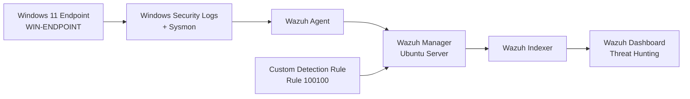

# Detection and Incident Response Lab

This is a home cybersecurity lab built with Wazuh, Sysmon, and a Windows 11 endpoint. I built it to practice endpoint monitoring, threat hunting, Windows event analysis, and basic detection engineering in a controlled environment.

I started by setting up the Wazuh server and connecting a Windows endpoint. From there, I generated different types of Windows activity, investigated the resulting events in Wazuh, mapped detections to MITRE ATT&CK, and created a custom Wazuh detection rule.

## Lab Environment

The lab runs in VMware and includes:

- Ubuntu Server 24.04.4 LTS running the Wazuh server
- Windows 11 endpoint named `WIN-ENDPOINT`
- Wazuh Manager, Indexer, and Dashboard
- Wazuh Windows Agent
- Microsoft Sysmon
- VMware NAT networking

Sysmon collects detailed endpoint activity from the Windows VM. The Wazuh agent forwards those events to the Wazuh server, where they can be searched and investigated through Threat Hunting.

## Lab Architecture



The Windows endpoint generates Security and Sysmon events. The Wazuh agent sends them to the server, where the manager analyzes the events, the indexer stores them, and the dashboard provides the Threat Hunting interface used during the investigations.

[Diagram source](diagrams/lab-architecture.mmd)

## Investigations

### Local Account Privilege Change

Created a temporary local account named `wazuhlab` and added it to the local `Administrators` group.

Wazuh captured:

- Event ID `4720` - User account created
- Event ID `4732` - Member added to a local security group

[Local Account Privilege Change Investigation](notes/account-privilege-change-investigation.md)

### Scheduled Task Creation

Created a scheduled task named `WazuhLabTask` that launched Notepad when a user logged on.

Wazuh captured:

- Event ID `4698` - Scheduled task created
- MITRE ATT&CK `T1053.005` - Scheduled Task

[Scheduled Task Creation Investigation](notes/scheduled-task-investigation.md)

### Account Discovery

Ran basic Windows account discovery commands:

```powershell
whoami
net user
net localgroup Administrators
```

Wazuh detected the activity with Rule ID `92031` and mapped it to:

```text
T1087 - Account Discovery
T1087.001 - Local Account
```

[Account Discovery Investigation](notes/account-discovery-investigation.md)

## Custom Detection Rule

After confirming that Wazuh's built-in Account Discovery rule worked, I created a custom rule that specifically detects `net user` and `net1 user`.

The rule uses:

```text
Rule ID: 100100
Alert Level: 10
MITRE ATT&CK: T1087.001
```

```xml
<group name="local,windows,account_discovery,">

  <rule id="100100" level="10">
    <if_sid>92031</if_sid>
    <field name="win.eventdata.commandLine" type="pcre2">(?i)(?:net|net1)(?:\.exe)?\s+user\b</field>
    <description>Custom detection: Local account discovery using net user</description>
    <mitre>
      <id>T1087.001</id>
    </mitre>
  </rule>

</group>
```

I validated the rule before restarting Wazuh:

```bash
sudo /var/ossec/bin/wazuh-analysisd -t
```

After restarting the manager and running `net user` again, Rule ID `100100` generated a Level 10 alert.

[Custom rule file](rules/account_discovery_rules.xml)

## Evidence

### Wazuh Dashboard


### Sysmon Telemetry in Wazuh


### Custom Account Discovery Detection


## Project Structure

```text
detection_incident_response_lab/
|
|-- diagrams/
|   `-- lab-architecture.mmd
|
|-- notes/
|   |-- lab-setup-and-monitoring.md
|   |-- account-privilege-change-investigation.md
|   |-- scheduled-task-investigation.md
|   `-- account-discovery-investigation.md
|
|-- rules/
|   `-- account_discovery_rules.xml
|
|-- screenshots/
|   |-- wazuh-dashboard-overview.png
|   |-- wazuh-services-active.png
|   |-- sysmon-events-wazuh.png
|   |-- user-account-created.png
|   |-- admin-group-membership-added.png
|   |-- scheduled-task-created.png
|   |-- account-discovery-net-user.png
|   |-- custom-rule-command-evidence.png
|   `-- custom-rule-detection.png
|
|-- .gitignore
`-- README.md
```

## What I Practiced

This project gave me hands-on practice with Wazuh, Sysmon, Windows Security events, Threat Hunting, MITRE ATT&CK mapping, and custom detection rules.

The part I learned the most from was following activity from the Windows endpoint into Wazuh and using the event fields to understand why a detection fired. That also helped when building the custom rule, since I had to adjust the detection logic based on the actual command line Wazuh recorded.

## Lab Setup

The full setup and monitoring notes are available here:

[Lab Setup and Monitoring](notes/lab-setup-and-monitoring.md)