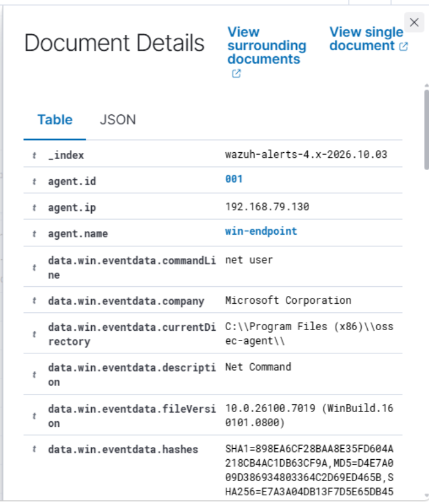

# Account Discovery Investigation

## Lab Activity Performed

Started by running basic Windows account discovery commands on `WIN-ENDPOINT` to view the current user, local accounts, and members of the local `Administrators` group.

My goal was to test whether Wazuh could detect account enumeration activity from the Windows endpoint.

## Commands Used

```powershell
whoami
net user
net localgroup Administrators
```

## Detection Summary

Verified in Wazuh that the account discovery activity generated a detection.

- Endpoint: `WIN-ENDPOINT`
- Command detected: `net user`
- Wazuh Rule ID: `92031`
- Rule description: `Discovery activity executed`

## MITRE ATT&CK Mapping

- Technique: Account Discovery
- Technique ID: `T1087`
- Sub-technique: Local Account
- Sub-technique ID: `T1087.001`

## Evidence Collected

### Account Discovery Using `net user`



## Assessment

In a production environment, unexpected account enumeration can be a sign of reconnaissance after an attacker gains access to a system.

We should always verify which user ran the command, what process launched it, whether the activity was authorized, and whether additional discovery commands were executed around the same time.

## Result

Successfully generated, detected, and investigated local account discovery activity on `WIN-ENDPOINT` using Wazuh.