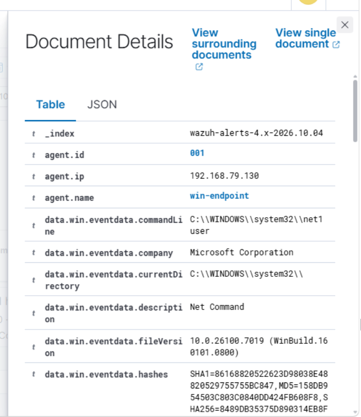
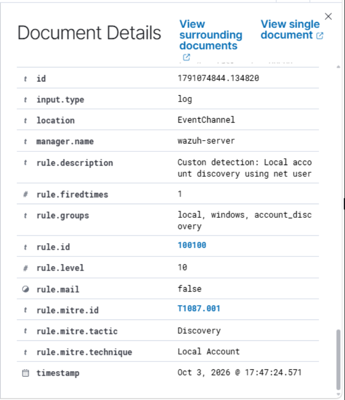

# Account Discovery Investigation

## Lab Activity Performed

Started by running basic Windows account discovery commands on `WIN-ENDPOINT` to view the current user, local accounts, and members of the local `Administrators` group.

My goal was to test whether Wazuh could detect account enumeration activity from the Windows endpoint.

## Commands Used

```powershell
whoami
net user
net localgroup Administrators
```

## Detection Summary

Verified in Wazuh that the account discovery activity generated a detection.

- Endpoint: `WIN-ENDPOINT`
- Command detected: `net user`
- Wazuh Rule ID: `92031`
- Rule description: `Discovery activity executed`

## MITRE ATT&CK Mapping

- Technique: Account Discovery
- Technique ID: `T1087`
- Sub-technique: Local Account
- Sub-technique ID: `T1087.001`

## Custom Detection Rule

After confirming that Wazuh's built-in Rule ID `92031` detected the account discovery activity, I created a custom rule to specifically detect use of `net user` and `net1 user`.

The custom rule uses Rule ID `100100`, raises the alert level to `10`, and maps the activity to MITRE ATT&CK `T1087.001` - Local Account Discovery.

```xml
<group name="local,windows,account_discovery,">

  <rule id="100100" level="10">
    <if_sid>92031</if_sid>
    <field name="win.eventdata.commandLine" type="pcre2">(?i)(?:net|net1)(?:\.exe)?\s+user\b</field>
    <description>Custom detection: Local account discovery using net user</description>
    <mitre>
      <id>T1087.001</id>
    </mitre>
  </rule>

</group>
```

The rule is also stored separately in:

```text
rules/account_discovery_rules.xml
```

## Custom Rule Validation

Before restarting the Wazuh manager, I checked the rule syntax with:

```bash
sudo /var/ossec/bin/wazuh-analysisd -t
```

After the validation returned without errors, I restarted the manager and confirmed that it was running:

```bash
sudo systemctl restart wazuh-manager
sudo systemctl is-active wazuh-manager
```

I then ran the account discovery command again on `WIN-ENDPOINT`:

```powershell
net user
```

Wazuh generated a new alert using my custom Rule ID `100100`.

## Evidence Collected

### Account Discovery Using `net user`


### Custom Rule Command Evidence



### Custom Rule Detection



## Assessment

In a production environment, unexpected account enumeration can be a sign of reconnaissance after an attacker gains access to a system.

We should verify which user ran the command, what process launched it, whether the activity was authorized, and whether additional discovery commands were executed around the same time.

## Result

Successfully generated and investigated local account discovery activity on `WIN-ENDPOINT`, confirmed Wazuh's built-in detection, and created a custom Level 10 rule that detected the same activity using Rule ID `100100`.