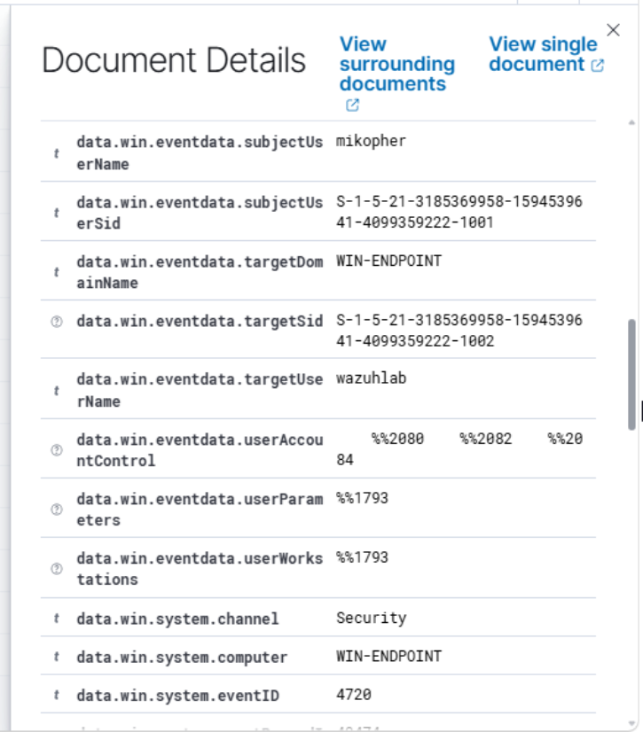
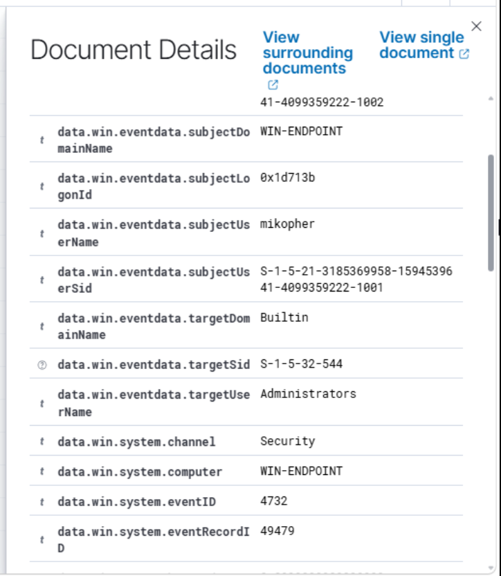

# Local Account Privilege Change Investigation

## Lab Activity Performed

Started by creating a local user account named `wazuhlab` on `WIN-ENDPOINT`. After creating the account, I added it to the local `Administrators` group.

The goal was to test whether Wazuh could detect both account creation and a privilege-related group change.

## Commands Used

```powershell
net user wazuhlab TempLab123! /add
net localgroup Administrators wazuhlab /add
```

## Detection Summary

Verified in Wazuh that both actions generated Windows Security events.

- Endpoint: `WIN-ENDPOINT`
- Account: `wazuhlab`
- Event ID `4720`: A user account was created
- Event ID `4732`: A member was added to a security-enabled local group
- Target group: `Administrators`

## Evidence Collected

### User Account Creation



### Administrator Group Membership Change



## Assessment

This activity was intentionally generated as part of the lab. In a production environment, a newly created local account being added to the `Administrators` group would be worth investigating because it gives that account elevated privileges.

Analysts should check who created the account, whether the change was approved, and whether the account performed any additional activity afterward.

## Cleanup Command Used

After verifying the detections, I removed the temporary account.

```powershell
net user wazuhlab /delete
```

## Result

Successfully generated, detected, and investigated a local account privilege change on `WIN-ENDPOINT` using Windows Security events and Wazuh.