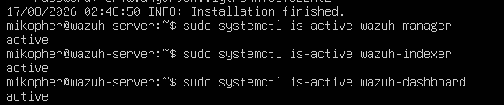
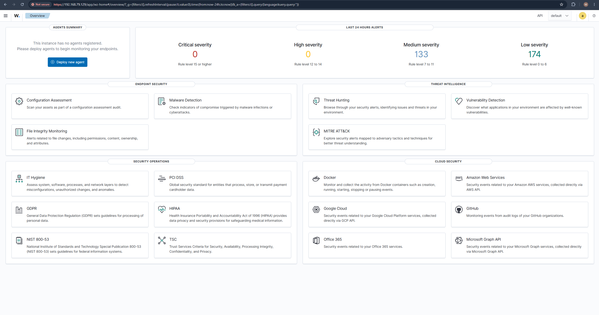
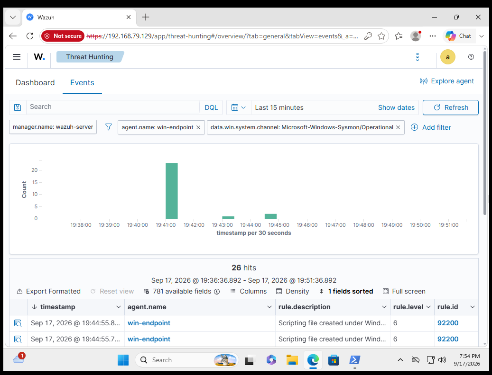

# Detection and Incident Response Lab Setup

## Lab Environment

I built the lab in VMware using an Ubuntu Server VM for Wazuh and a Windows 11 VM as the monitored endpoint.

### Ubuntu Wazuh Server
- Ubuntu Server 24.04.4 LTS
- 8 GB RAM
- 4 CPU cores
- 80 GB virtual disk
- NAT networking
- OpenSSH enabled

I expanded the Ubuntu root filesystem to use approximately 77 GB of available disk space and created a clean VMware snapshot before installing Wazuh.

## Wazuh Server Setup

I installed Wazuh using the official all-in-one installation method.

The environment included:
- Wazuh Manager
- Wazuh Indexer
- Wazuh Dashboard
- Filebeat

I verified the main Wazuh services using:

```bash
sudo systemctl is-active wazuh-manager
sudo systemctl is-active wazuh-indexer
sudo systemctl is-active wazuh-dashboard
```

Each service returned:

```text
active
```

I accessed the Wazuh dashboard through HTTPS from the Windows endpoint. The browser displayed a certificate warning because the lab uses a locally generated certificate.

## Windows Endpoint Setup

I created a Windows 11 endpoint with the hostname:

```text
WIN-ENDPOINT
```

I installed the Wazuh agent and connected the endpoint to the Wazuh server.

I verified the agent service using:

```powershell
Get-Service WazuhSvc
```

The service showed:

```text
Running
```

## Sysmon Monitoring

I installed Microsoft Sysmon on `WIN-ENDPOINT` and configured it to generate detailed Windows endpoint telemetry.

I verified Sysmon using:

```powershell
Get-Service Sysmon64
```

I also confirmed that Sysmon events were being generated locally from:

```text
Microsoft-Windows-Sysmon/Operational
```

## Wazuh and Sysmon Integration

I configured the Wazuh Windows agent to collect events from the Sysmon Operational event channel.

I then verified the complete monitoring pipeline:

```text
Windows Endpoint
      ↓
    Sysmon
      ↓
 Wazuh Agent
      ↓
 Wazuh Server
      ↓
Threat Hunting Dashboard
```

Wazuh successfully displayed Sysmon telemetry originating from `WIN-ENDPOINT`.

## Evidence Collected

### Wazuh Services Running


### Wazuh Dashboard


### Sysmon Events in Wazuh


## Result

The lab provides a working Windows endpoint monitoring environment that I can use to generate controlled security activity, detect it with Wazuh, investigate the resulting events, and document the findings.