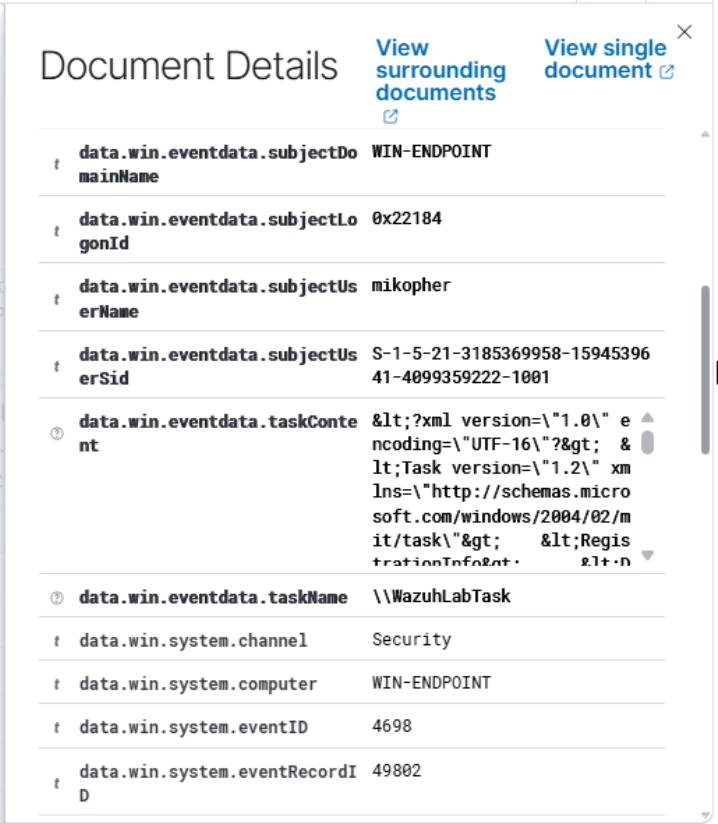

# Scheduled Task Creation Investigation

## Lab Activity Performed

Started by creating a scheduled task named `WazuhLabTask` on `WIN-ENDPOINT`. The task was configured to launch Notepad when a user logs on.

I performed this activity to test whether Wazuh could detect scheduled task creation on the Windows endpoint.

## Commands Used

First, I enabled auditing for scheduled task-related object access events:

```powershell
auditpol /set /subcategory:"Other Object Access Events" /success:enable
```

I then created and verified the scheduled task:

```powershell
schtasks /create /tn "WazuhLabTask" /tr "notepad.exe" /sc ONLOGON /f
schtasks /query /tn "WazuhLabTask"
```

## Detection Summary

Verified in Wazuh that Windows generated a scheduled task creation event.

- Endpoint: `WIN-ENDPOINT`
- Task: `WazuhLabTask`
- Event ID `4698`: A scheduled task was created
- Event channel: `Security`
- User: `mikopher`

## MITRE ATT&CK Mapping

- Technique: Scheduled Task/Job
- Technique ID: `T1053`
- Sub-technique: Scheduled Task
- Sub-technique ID: `T1053.005`

## Evidence Collected

### Scheduled Task Creation



## Assessment

This activity was intentionally generated as part of the lab. In a production environment, an unexpected scheduled task should be investigated because it can be used for persistence or automatic execution.

An analyst should verify who created the task, what program or script it launches, when it is configured to run, and whether the task was authorized.

## Cleanup Command Used

After verifying the detection, I removed the temporary scheduled task.

```powershell
schtasks /delete /tn "WazuhLabTask" /f
```

## Result

Successfully generated, detected, and investigated scheduled task creation on `WIN-ENDPOINT` using Windows Security Event ID `4698` and Wazuh.